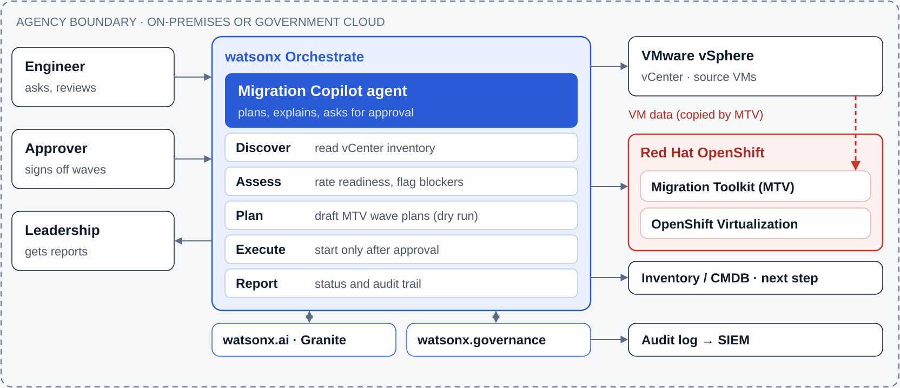

# AI Migration Copilot

An AI assistant that helps teams move virtual machines (VMs) from **VMware** to
**Red Hat OpenShift Virtualization**. You ask it questions in plain English. It finds your
VMs, rates how ready each one is, drafts migration plans, and runs a migration only after
an authorized person approves it.



**This page is a step-by-step guide for complete beginners.** You don't need to know
Python, OpenShift or AI to start. Each stage ends with a ✅ checkpoint so you know it worked
before moving on.

> **Safe by default.** Until you connect real systems (Stage 6), everything uses made-up
> sample VMs and changes nothing.

---

## Which stages do you need?

| Your goal | Do these stages | Time |
| --- | --- | --- |
| See what it does | 0 → 2 | 20 min |
| Demo the AI conversation on your laptop | 0 → 3 | 30 min |
| Run it the "real" way in watsonx Orchestrate | 0 → 4 | 1–2 hours |
| Migrate real test VMs in a lab | 0 → 7 | 1–2 days, with help from your OpenShift and VMware admins |
| Use it in production | All stages + Stage 8 checklist | Plan with your security team |

---

## Contents

- [Stage 0: Install the basic tools](#stage-0-install-the-basic-tools)
- [Stage 1: Get the code](#stage-1-get-the-code)
- [Stage 2: See it work with sample data](#stage-2-see-it-work-with-sample-data)
- [Stage 3: Chat with it using Claude or GPT](#stage-3-chat-with-it-using-claude-or-gpt)
- [Stage 4: Run it in watsonx Orchestrate](#stage-4-run-it-in-watsonx-orchestrate)
- [Stage 5: Prepare a test lab](#stage-5-prepare-a-test-lab)
- [Stage 6: Connect the Copilot to the lab](#stage-6-connect-the-copilot-to-the-lab)
- [Stage 7: Run your first real migration](#stage-7-run-your-first-real-migration)
- [Stage 8: Checklist before production](#stage-8-checklist-before-production)
- [If something goes wrong](#if-something-goes-wrong)
- [Making changes to this project](#making-changes-to-this-project)
- [What's in this repository](#whats-in-this-repository)

**New words?** VM, MTV, wave, API key and the other terms are explained in the
[glossary](migration-copilot/README.md#words-youll-see).

---

## Stage 0: Install the basic tools

You need three things: **Git** (downloads the code), **Python 3.11 or newer** (runs it), and
a **terminal** (where you type commands).

> **What's a terminal?** A window where you type commands instead of clicking.
> On a Mac, open **Terminal** (press ⌘ + Space, type "Terminal", press Enter).
> Type each command below, press **Enter**, and wait for it to finish before the next one.

### Mac

1. Install **Homebrew**, a tool that installs other tools. Paste the command from
   <https://brew.sh> into Terminal and follow the prompts.
2. Install Git and Python:
   ```bash
   brew install git python@3.12
   ```

### Windows

The scripts in this project are written for Mac/Linux, so on Windows you run them inside
**WSL** (Windows Subsystem for Linux), which gives you a Linux terminal.

1. Open **PowerShell as Administrator** (right-click the Start button → *Terminal (Admin)*).
2. Run `wsl --install`, then restart your computer.
3. Open **Ubuntu** from the Start menu and create a username and password when asked.
4. From now on, type every command in the **Ubuntu** window and follow the Linux steps.

### Linux (Ubuntu/Debian), including WSL

```bash
sudo apt update && sudo apt install -y git python3 python3-venv python3-pip
```

### ✅ Checkpoint

```bash
git --version        # shows something like: git version 2.45.0
python3 --version    # must show 3.11 or higher
```

If `python3 --version` shows 3.10 or lower, install a newer Python before continuing.

**Optional:** install a code editor such as [VS Code](https://code.visualstudio.com) to open
and edit files more easily.

---

## Stage 1: Get the code

```bash
cd ~/Desktop                                         # where to put the project
git clone https://github.com/Here2ServeU/ai-vm-ocp-migrations.git
cd ai-vm-ocp-migrations/migration-copilot            # the Copilot lives in this folder
```

Now create a **virtual environment**, a private space for this project's Python libraries so
they don't clash with anything else on your computer:

```bash
python3 -m venv venv
source venv/bin/activate
pip install -r requirements-local.txt                # takes a few minutes
cp .env.example .env                                 # your personal settings file
```

> **Every time you open a new terminal**, go back into the project and turn the
> environment on again:
> ```bash
> cd ~/Desktop/ai-vm-ocp-migrations/migration-copilot
> source venv/bin/activate
> ```
> You'll see `(venv)` at the start of the line when it's on.

### ✅ Checkpoint

Your prompt starts with `(venv)`, and `ls` shows files such as `demo_local.py` and
`chat_local.py`. Files starting with a dot are hidden, so use `ls -a` to see your new `.env`.

---

## Stage 2: See it work with sample data

```bash
python demo_local.py
```

This reads the made-up VMs in a sample "finance" cluster, rates each one, and prints the
migration plan the Copilot would draft. It doesn't use AI and needs no accounts.

### ✅ Checkpoint

You see a table and a plan like this:

```
[demo mode] finance cluster

VM            Readiness          Risk  Notes
fin-web-01    Ready                 0  -
fin-app-01    Ready                 0  -
fin-web-02    Ready with prep      10  Remove or consolidate snapshots before migrating
fin-db-01     Blocked              35  Uses a raw device mapping (RDM) disk; ...

Draft MTV plan (dry run):
...
```

A line saying `No credentials found for connections 'vcenter'` is normal. It just means
you're in demo mode.

**What the readiness ratings mean:** *Ready* can move now. *Ready with prep* needs a small
fix first. *Blocked* can't move as-is. *Retire candidate* is switched off, so ask its owner
whether it's still needed. See the [readiness rules](migration-copilot/README.md#readiness-rules).

---

## Stage 3: Chat with it using Claude or GPT

Now add the AI. You need an **API key**, a secret password that lets the Copilot use an AI
service. Pick **one** provider:

| Provider | Where to get a key |
| --- | --- |
| Anthropic (Claude) | <https://console.anthropic.com> → **API Keys** → **Create Key** |
| OpenAI (GPT) | <https://platform.openai.com/api-keys> → **Create new secret key** |

You'll need to add a payment method on the provider's site. A practice session usually
costs a few cents.

**1. Save the key in `.env`.** Open `.env` in your editor (`code .env` if you use VS Code,
or `nano .env` in the terminal; in nano, save with Ctrl+O then Enter, and exit with Ctrl+X).
Fill in the line for your provider:

```
ANTHROPIC_API_KEY=sk-ant-...your key...
```
or
```
OPENAI_API_KEY=sk-...your key...
```

> 🔒 **Treat API keys like passwords.** Never paste them into code, chat messages or
> emails. `.env` is set up so Git never uploads it.

**2. Start the chat:**

```bash
python chat_local.py --llm anthropic      # or: python chat_local.py --llm openai
```

**3. Try this conversation.** Type each line after `you>` and press Enter:

```
you> How ready is the finance cluster to move?
you> Draft wave 1 with the lowest-risk VMs into the finance-prod project.
you> Start it.
you> Approved by Jane Smith, ticket CHG-1234.
you> Approved by Emmanuel Naweji, ticket CHG-1234.
you> What's the status?
```

Type `exit` to quit.

### ✅ Checkpoint

- The Copilot answers the readiness question with a table, and shows `[tool] ...` lines
  when it looks things up.
- When you say "Start it", it asks who approves.
- It **refuses** Jane Smith and **accepts** Emmanuel Naweji. Only authorized approvers can
  start a migration. This rule is enforced in code, so it holds whichever AI model you use.
- Asking for status a few times shows progress climbing to 100%.

---

## Stage 4: Run it in watsonx Orchestrate

**watsonx Orchestrate** is IBM's platform for running AI agents. It gives the Copilot a web
chat page and keeps credentials locked away safely. Here you run the free
**Developer Edition** on your own computer, still with sample data.

**You need:** about **16 GB of free memory, 8 CPU cores and 100 GB of free disk**.
You don't need to install Docker; Orchestrate sets up its own small virtual machine.

### 4.1 Get IBM credentials

Orchestrate needs an IBM account to start, **even if the agent will use Claude or GPT**.
Pick one option and fill in the matching lines at the top of `.env`:

- **Option 1: watsonx Orchestrate account** (a free trial works). Sign up at
  <https://www.ibm.com/products/watsonx-orchestrate>. In your Orchestrate instance, open
  your profile menu → **Settings** → **API details**. Copy the **service instance URL**
  into `WO_INSTANCE` and generate an **API key** for `WO_API_KEY`.
- **Option 2: watsonx.ai.** Put your **entitlement key** from My IBM in
  `WO_ENTITLEMENT_KEY`, and your watsonx.ai API key and deployment space ID in
  `WATSONX_APIKEY` and `WATSONX_SPACE_ID`. Set `WO_DEVELOPER_EDITION_SOURCE=myibm`.

The comments in `.env` show exactly which lines go with which option.

### 4.2 Start Orchestrate and load the Copilot

```bash
set -a; source .env; set +a                      # load your settings into this terminal
orchestrate server start -e .env                 # first start downloads a lot: 15–30 min
orchestrate env activate local
```

The first time, it asks you to accept IBM's terms. Type `y` and press Enter.

Next, choose which AI the agent uses. Pick **one** line:

```bash
./scripts/setup.sh --demo                        # IBM watsonx model
./scripts/setup.sh --demo --llm anthropic        # Claude (uses ANTHROPIC_API_KEY)
./scripts/setup.sh --demo --llm openai           # GPT (uses OPENAI_API_KEY)
```

Then open the chat:

```bash
orchestrate chat start                           # opens the chat page in your browser
```

> **Where does my data go?** With the IBM watsonx model, everything stays inside your
> environment. With Claude or GPT, your questions and the Copilot's findings (VM names,
> sizes, plans) are sent to Anthropic or OpenAI. The diagram at the top shows this.

### ✅ Checkpoint

The chat page opens, you can select **AI Migration Copilot**, and the Stage 3 conversation
works the same way. Answers mention **demo mode**.

When you're finished, `orchestrate server stop` frees up your computer's memory.

---

## Stage 5: Prepare a test lab

From here on you work with **real systems**. Use a **test lab**, never production, and pick
**5–10 throwaway VMs** to practice on. You'll need help from:

- **Your OpenShift admin** for Steps 5.1–5.3
- **Your VMware admin** for Step 5.4

### 5.1 Install the OpenShift command-line tool (`oc`)

In the OpenShift web console, click the **?** icon (top right) → **Command Line Tools**,
download `oc` for your computer, and put it on your PATH. Then log in:

```bash
oc login --server=https://api.your-cluster.example:6443      # your admin gives you this address
oc whoami                                                    # shows your username if it worked
```

### 5.2 Install the Migration Toolkit for Virtualization (MTV)

MTV is the Red Hat add-on that actually copies VMs. In the OpenShift console:

1. **Operators → OperatorHub**, search for **Migration Toolkit for Virtualization**, click
   **Install**, and accept the defaults. It installs into the `openshift-mtv` project.
2. When the install finishes, click **Create ForkliftController** and accept the defaults.
   A **Migration** section appears in the left menu.
3. **Migration → Providers for virtualization → Create Provider → vSphere.** Enter your
   vCenter address and credentials. Red Hat recommends adding a **VDDK image** here for
   faster disk copies; your admin can set it up. **Write down the provider name.**
4. **Migration → NetworkMaps for virtualization → Create.** Match each VMware network to an OpenShift network.
   **Write down the name.**
5. **Migration → StorageMaps for virtualization → Create.** Match each VMware datastore to an OpenShift
   storage class. **Write down the name.**

### 5.3 Give the Copilot its own limited account

The Copilot gets a service account that can **only** create MTV plans and migrations and
read VMs. It can't delete anything.

```bash
oc apply -f openshift/rbac.yaml
oc new-project finance-prod                       # the project migrated VMs will run in
oc create rolebinding migration-copilot-view -n finance-prod \
  --clusterrole=migration-copilot-vm-viewer \
  --serviceaccount=openshift-mtv:migration-copilot
oc create token migration-copilot -n openshift-mtv --duration=8h
```

The last command prints a long **token**. Copy it; you'll need it in Stage 6.

> ⏱ The token **expires after 8 hours**. When it does, the Copilot's OpenShift tools stop
> working. Run the `oc create token` line again, update `.env`, and rerun `setup.sh`.

### 5.4 Get a read-only vCenter account

Ask your VMware admin for a vCenter user with the **Read-only** role. The Copilot only
**reads** from vCenter, so it should never have more access than that.

### ✅ Checkpoint

You have written down: the vCenter address, read-only username and password, the OpenShift
API address, the token, and the MTV **provider**, **NetworkMap** and **StorageMap** names.

---

## Stage 6: Connect the Copilot to the lab

**1. Fill in the lab section of `.env`:**

```
VCENTER_URL=https://vcenter.your-agency.example
VCENTER_USER=svc-copilot-readonly@vsphere.local
VCENTER_PASSWORD=...
OCP_API_URL=https://api.your-cluster.example:6443
OCP_TOKEN=...the token from Stage 5.3...
MTV_SOURCE_PROVIDER=...provider name...
MTV_NETWORK_MAP=...NetworkMap name...
MTV_STORAGE_MAP=...StorageMap name...
MIGRATION_APPROVERS="Emmanuel Naweji"
```

`MIGRATION_APPROVERS` lists who may approve migrations. To add people, separate full names
with commas, for example `"Emmanuel Naweji, Ada Lovelace"`.

**2. Load everything into Orchestrate.** This time leave out `--demo`:

```bash
set -a; source .env; set +a
orchestrate server start -e .env                 # skip if it's already running
orchestrate env activate local
./scripts/setup.sh --llm anthropic               # or --llm openai, or leave --llm out for watsonx
orchestrate chat start
```

`setup.sh` stores the vCenter and OpenShift credentials inside Orchestrate
**connections**, so they never appear in the code.

### ✅ Checkpoint

Ask *"List all VMs"*. You see **your real test VMs**, and the answer says **live** mode
instead of demo mode.

---

## Stage 7: Run your first real migration

Pick **one or two small, unimportant test VMs**. The Copilot guides you through each step:

1. **Discover.** *"How ready are the VMs in the test cluster?"*
2. **Plan (dry run).** *"Draft a plan called test-wave-1 with vm-123 into the finance-prod
   project."* It shows the plan, but nothing is saved yet.
3. **Save the plan.** *"Looks good. Save it."* The plan is now stored in MTV, but
   **nothing has moved**.
4. **Approve and start.** *"Approved by Emmanuel Naweji, ticket CHG-1001. Start
   test-wave-1."* The migration begins. Your name, the time and the ticket are recorded on
   the migration in OpenShift and in the audit log.
5. **Watch progress.** *"What's the status of test-wave-1?"* Ask every few minutes. You can
   also watch it under **Migration → Plans for virtualization** in the OpenShift console.
6. **Check the result.** *"List the VMs in finance-prod."* The VM shows as **Running**.
   Log in to it and confirm the application works.

**If something goes wrong:** the original VM is still in vCenter; MTV doesn't delete it.
Power it back on in vCenter, then delete the migrated copy in OpenShift.

### ✅ Checkpoint

Your test VM runs on OpenShift, and the migration record in OpenShift shows who approved it
and when.

---

## Stage 8: Checklist before production

Go through this with your security and operations teams before migrating anything that
matters:

- [ ] **AI provider approved.** If you use Anthropic or OpenAI, VM names, sizes and plans
      leave your boundary. Get written approval, or use the IBM watsonx model.
- [ ] **Approvers set.** `MIGRATION_APPROVERS` lists only the people allowed to approve.
- [ ] **Least-privilege accounts.** vCenter is read-only, and the OpenShift account uses
      `openshift/rbac.yaml` unchanged.
- [ ] **Token process.** Someone owns renewing the OpenShift token before it expires.
- [ ] **Audit logs collected.** Tool logs containing `AUDIT` lines go to your SIEM.
- [ ] **Guest OS support checked** against Red Hat's current OpenShift Virtualization list.
      The Copilot's readiness rules are a starting point, not a certification.
- [ ] **Change process.** Every wave has a change ticket, and application owners know the
      downtime window.
- [ ] **Start small.** Begin with low-risk VMs and grow wave sizes as confidence builds.

---

## If something goes wrong

| Problem | What to do |
| --- | --- |
| `command not found: python` | Use `python3`, or turn on the environment: `source venv/bin/activate` |
| `ModuleNotFoundError` | Turn on the environment, then `pip install -r requirements-local.txt` |
| `ANTHROPIC_API_KEY is not set` | Check the key is in `.env` with no spaces around `=` |
| `401` or "authentication" errors from the AI | The key is wrong or was revoked. Create a new one |
| Orchestrate won't start | Check the `WO_...` lines in `.env` and that 16 GB of memory is free. `orchestrate server logs` shows details |
| `Permission denied: ./scripts/setup.sh` | Run `chmod +x scripts/setup.sh` |
| OpenShift tools suddenly fail with `401` | The 8-hour token expired. See the note in Stage 5.3 |
| The Copilot won't start a migration | Working as designed. An authorized approver must approve by name |

More fixes are in the [runbook's troubleshooting table](migration-copilot/README.md#troubleshooting).

---

## Making changes to this project

`main` is protected. Create a branch, push it, and open a pull request. Automatic checks
(linting, tests, security scans) must pass and the owner must approve before it merges.
See [CONTRIBUTING.md](CONTRIBUTING.md) for how to run the same checks on your computer.

---

## What's in this repository

| Path | What it is |
| --- | --- |
| [`migration-copilot/`](migration-copilot/) | The Copilot: agent, tools, scripts. Its [README](migration-copilot/README.md) explains every file |
| [`architecture.svg`](architecture.svg) | The diagram at the top of this page |
| [`CONTRIBUTING.md`](CONTRIBUTING.md) | How to propose changes |
| [`.github/`](.github/) | Automatic checks (CI), dependency updates, code owners |
| `pyproject.toml`, `.yamllint.yml`, `requirements-dev.txt` | Settings for the automatic code checks |
| `migration-copilot-starter.zip` | The original starter kit download |
